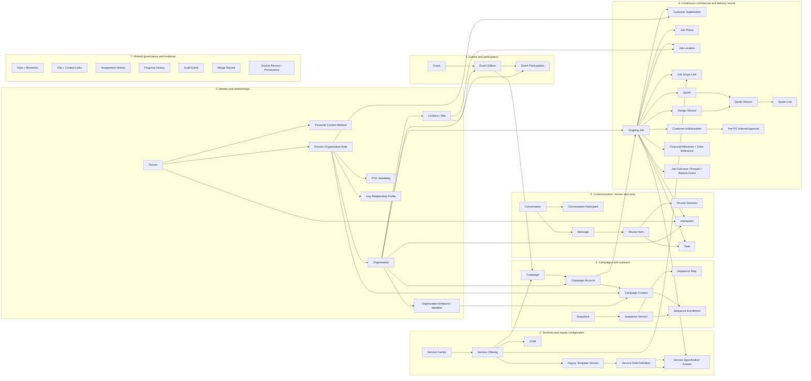
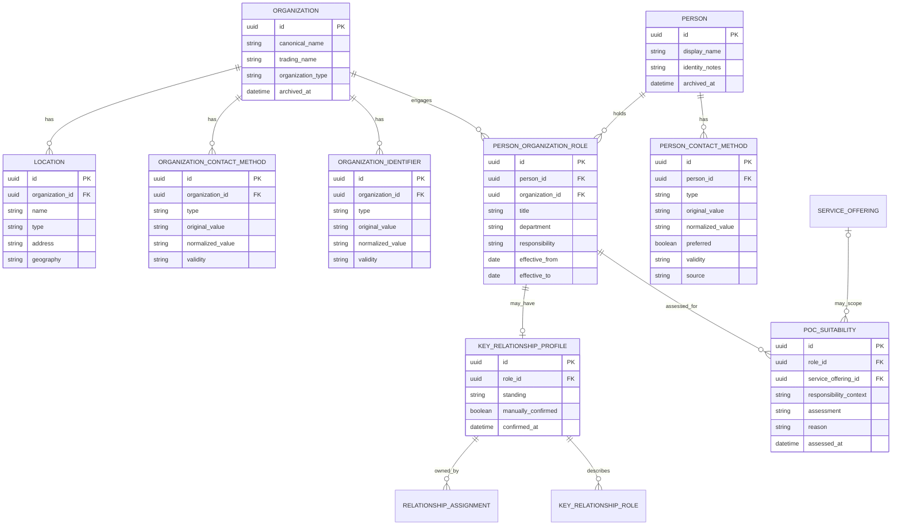
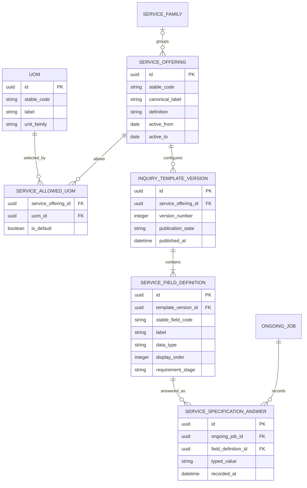
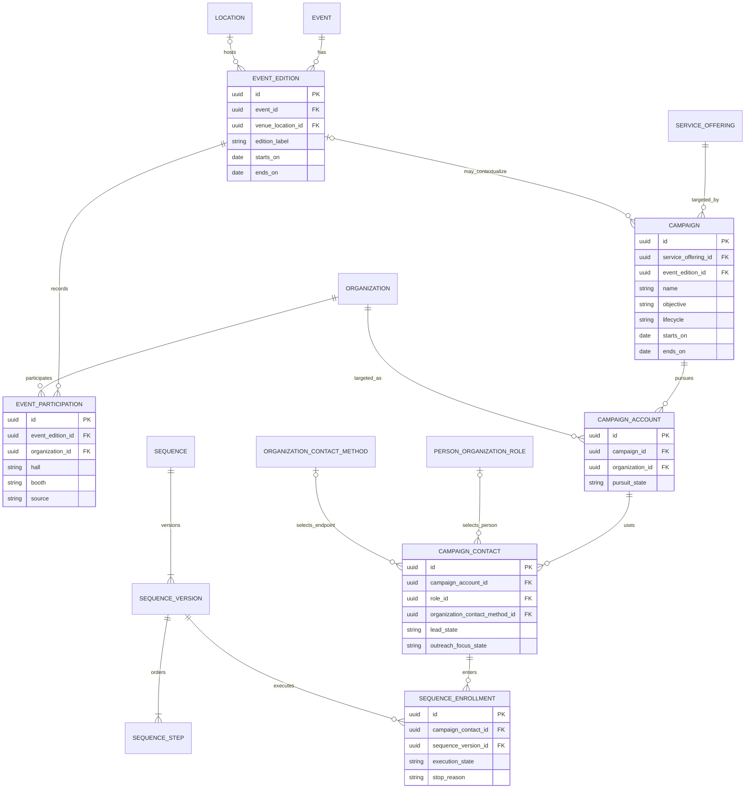
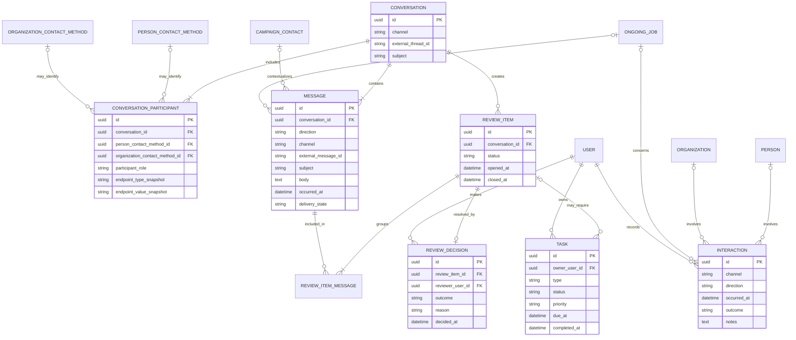
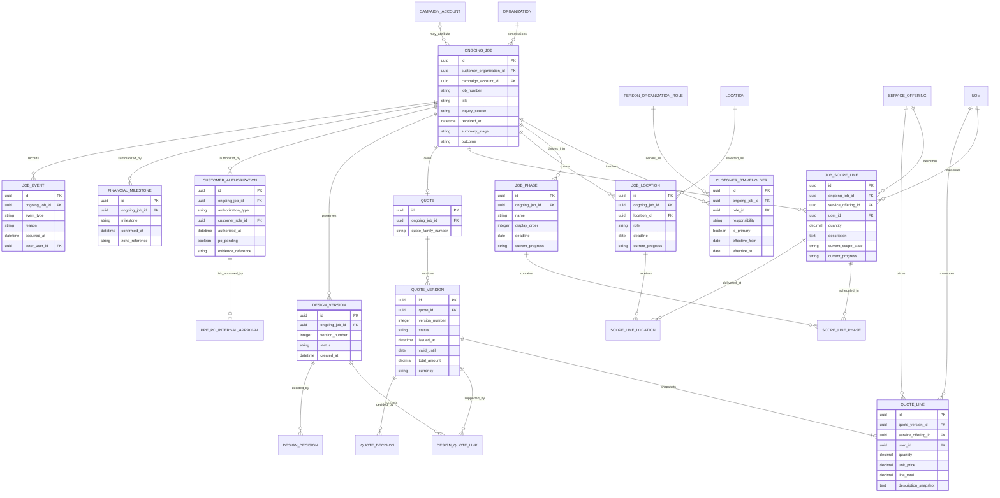

# EGS CRM Logical Entity–Relationship Diagram

Status: Target logical model for implementation review  
Business authority: [CRM Foundation Specification](./CRM_FOUNDATION_SPEC.md)  
Live source evidence: [Live Mongo Data Audit](./CRM_LIVE_MONGO_DATA_AUDIT.md)  
Companion execution guide: [Mongo-to-SQL AI Agent Migration Guide](./MONGO_TO_SQL_AI_AGENT_GUIDE.md)

## How to read this document

- This is the logical destination, not a copy of the current Mongo collections.
- Names describe business concepts. Talha may adapt physical table and column naming, but not the boundaries or meaning without recording a foundation decision.
- `one` means exactly one; `zero or one` means optional; `many` includes zero unless the relationship notes say otherwise.
- Historical/version records are preserved. Issued documents, decisions, messages, audit evidence, and migration provenance are not overwritten.
- The final 12 Service Offerings, their UOM choices, and inquiry questions can be loaded later. Their empty configurable structure is part of the model now.

## Whole system at a glance

The arrows above show navigation, not ownership of copied data. For example, a Person screen may show Jobs and Messages, but Person does not store copies of them.

## A. Identity, organization, and relationship ERD

Identity constraints:

- Names are never unique keys.
- Personal email and LinkedIn repetitions create duplicate-review cases; they do not cause automatic merges.
- Organization names and domains are matching evidence; neither is a guaranteed unique identity key.
- A generic inbox or switchboard is an Organization Contact Method, not a Person.
- A Person changing employer creates or closes Role records; it does not replace the Person.
- Merges are administrator-confirmed, audited, reversible operations.

## B. Services and configurable inquiry ERD

The `typed_value` label represents a logical typed answer. The physical SQL design should preserve validation and queryability using type-appropriate columns or another constrained design; it must not become an uncontrolled JSON dump.

## C. Events, campaigns, and outreach ERD

Campaign constraints:

- One Campaign targets exactly one Service Offering and may optionally relate to one Event Edition.
- One Campaign Account exists per Campaign + Organization pair.
- A Campaign Contact selects either a real Person–Organization Role or an Organization endpoint. It must not invent a Person for a generic inbox.
- Lead state belongs to Campaign Contact context, not Person.
- Outreach execution, message evidence, reply review, and suppression remain separate facts.

## D. Communication, review, interaction, and task ERD

Communication constraints:

- A Message is immutable evidence. Review results do not overwrite it.
- Several inbound Messages arriving before review may share one Review Item; a later reply after completion creates another Review Item.
- Classification is human-only for now.
- An internal Task is not an Interaction. A real call, email, WhatsApp exchange, meeting, or site visit is an Interaction or Message.
- Participant rows retain the exact endpoint used at the time.
- A Participant retains an endpoint snapshot even when its canonical Person/Organization link is missing or disputed. At most one canonical contact-method link is used; neither may be present for unresolved legacy evidence. This prevents orphaned historical communications from being lost or assigned to an invented identity.

## E. Ongoing Job, commercial, and delivery ERD

Job constraints:

- There is one continuous Ongoing Job from Inquiry through Job Done or Job Lost. Jobs Done is a view, not another table containing copied jobs.
- One quotation family and its revisions belong to one Ongoing Job. A separate quotation creates a separate Ongoing Job.
- One Ongoing Job has exactly one customer Organization, but may contain several stakeholders, services, phases, and locations.
- Current Job Scope Lines are editable working scope. Issued Quote Version and Quote Line content is an immutable commercial snapshot.
- Design approval and Quote approval are independent and point to exact versions.
- Physical delivery and financial settlement are separate. Job Done requires both delivered and fully paid according to Zoho-authoritative information.
- Production before formal PO requires recorded Customer Authorization plus authorized internal risk approval.
- Job Lost, reopen, warranty, correction, and rework remain events on the same Job unless a new/separate quotation is created.

## F. Shared ownership, evidence, and governance

The following apply across the domains without becoming duplicate business stores:

| Shared concept | Relationship rule |
|---|---|
| User | Owns or performs Assignments, Tasks, Reviews, Interactions, approvals, merges, and audited changes. |
| Assignment History | Records one accountable owner and optional collaborators for a Job or its component; effective dates preserve ownership changes. |
| Progress History | Append-only transition history for Job, phase, location, or scope-line progress. Current progress may be cached on its canonical component. |
| Note + Note Revision | A Note belongs to an explicit context. Edits retain author, timestamp, prior content, and reason where required. |
| File + File Link | One stored File can be linked to several explicit contexts. Issued or approved document versions are never overwritten. |
| Audit Event | Records actor, time, action, target, reason, and changed facts. It is not the business record itself. |
| Merge Record | Records survivor, duplicate, evidence, actor, moved relationships, and reversal history. |
| Source Record | Preserves original collection, Mongo `_id`, source payload/checksum or immutable archive reference, import run, and migration result. |
| Duplicate Review Case | Links candidate People or Organizations, matching evidence, reviewer decision, and resolution. It never automatically merges records. |
| Suppression | Applies to the exact contact endpoint by default; broader suppression requires explicit evidence and scope. |

### Explicit operational context links

The physical model must enforce the following links with named foreign keys or named bridge tables. They are shown as a table to keep the main diagrams readable.

| Record | Permitted explicit contexts | Rule |
|---|---|---|
| Task | Person, Organization, Campaign, Campaign Contact, Ongoing Job, Job Phase, Job Location, Job Scope Line, Review Item | One owner is required. A Task may have several relevant contexts, but every link must resolve to a real row. |
| Interaction | Person, Organization, Campaign Contact, Ongoing Job, and participating customer Roles | Record only real external contact. Retain channel, occurrence time, outcome, and recorder. |
| Note | Person, Organization, Campaign, Ongoing Job, Job Phase, Job Location, Job Scope Line, Task | Preserve revisions for important edits. |
| File | Message, Interaction, Note, Design Version, Quote Version, Customer Authorization, Ongoing Job, or component | Store the binary/object once; preserve the role of each context link. |
| Assignment History | Key Relationship Profile, Ongoing Job, Job Phase, Job Location, Job Scope Line | One accountable lead where required; collaborators and effective dates remain separate. |
| Progress History | Ongoing Job, Job Phase, Job Location, Job Scope Line | Append-only transitions; current progress belongs to the exact canonical component. |
| Source Record | Any imported target record through its migration crosswalk | A target may have several sources and one source may produce several target rows. |
| Audit Event | Any governed record changed by the new system | Append-only; the target ID must be resolvable and the changed facts preserved. |

For SQL referential integrity, context links should use named, foreign-key-backed relations for the supported core contexts. Do not rely on an unchecked `entity_type + entity_id` pair for canonical business relationships.

## Authoritative relationship and uniqueness checklist

| Relationship | Required database/business constraint |
|---|---|
| Campaign → Service Offering | Exactly one active reference on every Campaign. |
| Campaign Account | Unique Campaign + Organization pair. |
| Campaign Contact | Exactly one target kind: Person–Organization Role or Organization Contact Method. |
| Ongoing Job → Organization | Exactly one customer Organization. |
| Ongoing Job → Campaign Account | Optional, never required for direct/repeat work. |
| Ongoing Job → Quote | At most one logical Quote family. |
| Quote Version | Version number unique within Quote; issued content immutable. |
| Design Version | Version number unique within Ongoing Job; preserved rather than overwritten. |
| Customer Stakeholder | At most one active primary stakeholder per Ongoing Job. |
| Service Allowed UOM | Offering + UOM pair unique; at most one active default UOM per Offering. |
| Inquiry Template Version | Version number unique within Offering; published version immutable. |
| Sequence Step | Step order unique within Sequence Version. |
| Message | Provider/channel + external message identifier unique where supplied; collisions enter review. |
| Review Decision | At most one current final Decision per Review Item; corrections create audit/history rather than silent overwrite. |
| Task | Exactly one accountable owner; collaborators are separate assignments. |
| Contact methods | Normalized values indexed for duplicate detection, not globally forced to identify one Person/Organization. |
| Archive | Archived records retain IDs, relationships, provenance, and history. |

## Derived views, not new sources of truth

- `Jobs Done`: Ongoing Jobs with completed physical delivery and authoritative fully-paid confirmation.
- `Person Timeline`, `Organization Timeline`, and `Ongoing Job Timeline`: ordered union/read model over Messages, Interactions, Tasks, Reviews, Notes, versions, transitions, assignments, and approvals.
- Campaign counts and conversion metrics: derived from Campaign Accounts, Contacts, Enrollments, Messages, Reviews, and attributed Ongoing Jobs.
- Ongoing Job headline stage: controlled summary derived from commercial authorization, delivery progress, financial milestone, and outcome.
- Current balance, invoice detail, payment transactions, and credits: read/reference from Zoho, not a second CRM ledger.

## Acceptance scenarios

The logical/physical design is acceptable only if it can represent every scenario in the Foundation Specification, including duplicate names, concurrent employers, generic inboxes, multiple campaign contacts, direct Jobs, multiple services/phases/locations, independent design and quote approvals, pre-PO production, delivery before final payment, Job Lost after production, reopening, and post-completion warranty/rework without duplicating durable facts.
